# Computer Graphics Note

图形学课堂笔记

## 术语&概念

**计算机图形学之父**：

	伊凡.萨瑟兰(Ivan Edward Sutherland)

**图形学应用：**

	计算机辅助设计（Computer-Aided Design）

	虚拟现实环境（Virtual-Reality Environment）

	科学计算可视化（Scientific Visualization）

	电影（Movie）、游戏（Game）

**术语：**

	CGS（核心图形系统）

	CGI（计算机图形接口标准）

	CGM（计算机图形元文件）

	GKS（计算机图形核心系统）

	PHIGS（程序员层次交互式图形系统）

**GLSL（OpenGL的着色器语言，OpenGL Shading Language）**

	顶点着色器 Vertex Shader

	几何着色器Geometry Shader

	曲面细分着色器 Tessellation Shader

	片元着色器 Fragment Shader

**帧缓存容量=分辨率X颜色位数(bit)**

	例：

	分辨率为1024 X 768，24位真彩色

	帧缓存容量 = 1024 X 768 X 24bit = 768 X 3 KB (1Byte = 8bit)

**计算分辨率1024\*768,24位真彩色图像不经压缩的数据量是多少KB?**

	24位真彩，每个像素占24bit

	1024*768个像素点，所以就是1024*768*24=18874368（bit）

	再除以8转换为byte （8bit=1byte) =2359296(byte) ，又因为1024byte=1KB
	再除以1024等于2304KB

	1M=1024KB，再除以1024就是2.25MB

**常用数据类型**

&emsp;&emsp;**标量：**整数（int）、无符号整数（uint）、布尔类型（bool）及浮点数（float）

&emsp;&emsp;**矢量：**一个矢量可以有2、3、4个分量 ```Vec4 a = vec4(1.0, 2.0, 3.0, 4.0);```

&emsp;&emsp;**矩阵：**mat2 m = mat2(1.0, 2.0, 3.0, 4.0);

&emsp;&emsp;&emsp;&emsp;&emsp;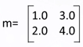

&emsp;&emsp;**结构/数组：**结构体的成员或者数组的基类型可以为任意的数据类型，例如：

&emsp;&emsp;&emsp;&emsp;&emsp;&emsp;&emsp;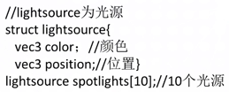

## 渲染流水线的三个概念阶段

### 应用阶段

将需要在屏幕上显示出来绘制的几何体，也就是绘制图元，
比如点、线、矩形等输入绘制管线的下一个阶段，
具体包括：图元的顶点数据、摄影机位置、光照纹理等参数；

### 几何阶段

将顶点数据进行最终的屏幕映射

这其中需要：
- 将各个图元放入到世界坐标系中，也就是进行模型变换；
- 根据光照纹理等计算顶点处材质的光照着色效果；
- 根据摄像机的位置、取景范围进行观察变换和裁剪；
- 最后进行屏幕映射，也就是把三维模型转换到屏幕坐标系中。

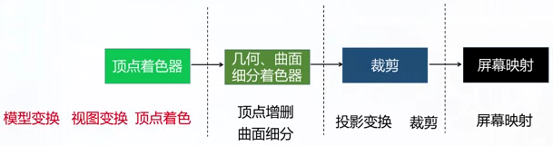

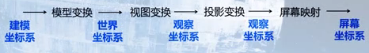

### 光栅化阶段

输入是经过变换和投影后的顶点、颜色以及纹理坐标，它的工作是给每个像素正确配色，以便绘制整幅图像

由于输入的是三角形顶点，所以需要根据三角形表面差异，逐个遍历三角形计算各个像素的颜色值，之后根据其可见性等进行合并得到最后的输出

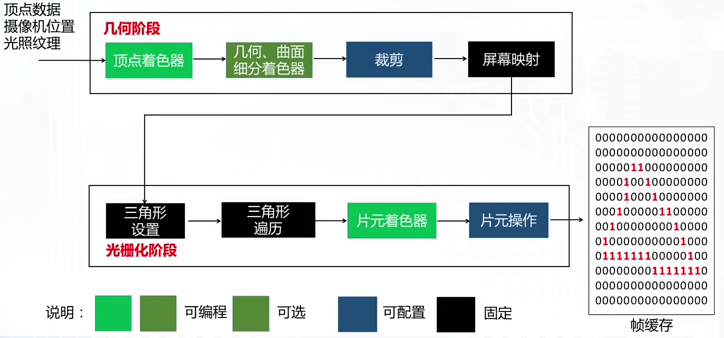

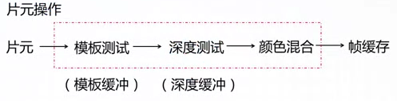

## EBO、VBO和VAO

### EBO, Element Buffer Object {docsify-ignore}

也叫IBO：Index Buffer Object，索引缓冲区对象，这个缓冲区主要用来存储顶点的索引信息。

### VBO, Vertex Buffer Object {docsify-ignore}

顶点缓冲区对象，主要用来存储顶点的各种信息。

优点：模型的顶点信息放入VBO，这样每次画模型时，数据不用再从CPU内存中取，而直接从GPU显存里取，提高效率。

### VAO, Vertex Array Object {docsify-ignore}

顶点数组对象，VAO是一个保存了所有顶点数据属性的状态集合，存储了顶点数据的格式以及顶点数据所需的VBO对象的引用。

## 绘制物体的通常流程

创建VAO

&emsp;&emsp;unsigned int VAO;

&emsp;&emsp;glGenVertexArrays(1, \&VAO);

创建VBO

&emsp;&emsp;unsigned int VBO;

&emsp;&emsp;glGenBuffers(1, \&VBO);

绑定VAO

&emsp;&emsp;glBindVertexArray(VAO);

绑定VBO

&emsp;&emsp;glBindBuffer(GL_ARRAY_BUFFER, VBO);

复制顶点数据到VBO（数据存到显存中）

&emsp;&emsp;glBufferData(GL_ARRAY_BUFFER, sizeof(finalVertices), finalVertices,
GL_STATIC_DRAW);

设置顶点属性指针

&emsp;&emsp;glVertexAttribPointer(0, 2, GL_FLOAT, GL_FALSE, 0, (void\*)0);

启用指针

&emsp;&emsp;glEnableVertexAttribArray(0);

设置shader  
&emsp;&emsp;glUseProgram(shaderProgram);

画顶点/线/物体

&emsp;&emsp;glDrawArrays(GL_POINTS, 0, point_count \>\> 1);

解除VBO绑定

&emsp;&emsp;glBindBuffer(GL_ARRAY_BUFFER, 0);

解除VAO绑定

&emsp;&emsp;glBindVertexArray(0);

释放VAO

&emsp;&emsp;glDeleteVertexArrays(1, \&VAO);

释放VBO

&emsp;&emsp;glDeleteBuffers(1, \&VBO);

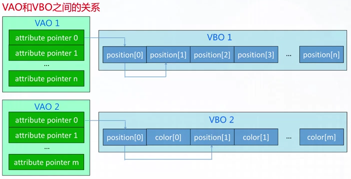

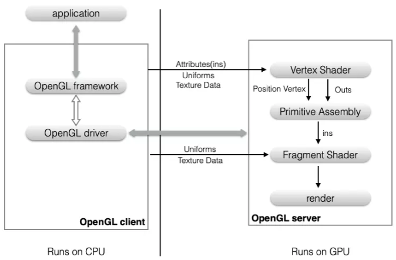

**client**  
&emsp;&emsp;application中的代码和OpenGL API是存储在CPU中的，属于client，由应用程序执行，在主系统内存的驱动程序中执行，驱动程序将数据不断地传递给server。

**server**  
&emsp;&emsp;OpenGL中直接操作GPU绘制图形的部分是server，client与server是独立异步执行的，他们分属于不同的软件块或硬件块。在server端，顶点着色器处理client传递过来的顶点数据，然后将图形进行光栅化，再由片元着色器填充颜色，完成图形的渲染。

**通道：Attributes、Uniforms、Texture Data**

&emsp;&emsp;OpenGL API向GPU传递数据有三个通道，分别是Attributes属性、Uniforms和Texture Data纹理数据，根据场景合理的使用对应的管道

**Attributes：**

&emsp;&emsp;属性传递的是不断发生改变的数据，传入的数据包括顶点坐标、纹理坐标、颜色值、位移、光照法线等，属性可以是整型、浮点型、布尔、4维向量等。Attributes只能传到顶点着色器，不能传到片元着色器，可以通过GLSL代码间接传递。

&emsp;&emsp;属性总是以4维向量的形式进行内部存储，顶点坐标是(x,y,z)，占3个分量；属性会从本地client内存中复制存储在图形硬件中的一个缓冲区上，这些属性只提供给顶点着色器使用。

**Uniforms：**

&emsp;&emsp;Uniform变量传递的是统一的数据，如旋转矩阵、变换矩阵等

&emsp;&emsp;图形旋转的实现是每一个顶点乘以旋转矩阵，确定旋转角度后旋转矩阵不会发生改变，这个旋转矩阵就可以通过Uniform传递，传递的数据类型有整型、浮点型、布尔、4维向量等。最常见的应用是在顶点渲染中设置变换矩阵。uniform值可以直接传递到顶点着色器和片元着色器。

&emsp;&emsp;uniform变量还可以是标量类型、矢量类型、uniform矩阵。

**Texture Data纹理数据：**

&emsp;&emsp;传递图片，渲染图形时的线框填充、颜色填充、纹理填充、像素填充等对图片的处理，在顶点着色器、片元着色器中都可以对纹理数据进行采样和筛选。

&emsp;&emsp;滤镜的实现就是在读取颜色的时候对像素点颜色的处理，可以读取多张纹理使用颜色混合对像素进行填充

&emsp;&emsp;典型的应用场景：片段着色器对一个纹理值进行采样，然后在一个三角形表面应用渲染纹理数据。

&emsp;&emsp;in(s) 输入：将数据拷贝到着色器中

&emsp;&emsp;out(s) 输出：将数据从一个阶段传递到下一个阶段，开发者无法参与干预其过程

&emsp;&emsp;Primitive Assembly 图元装配/光栅化：

&emsp;&emsp;将顶点链接起来组成点、线、面（三角形）三种不同的图元，然后对超出屏幕的部分进行裁剪，这是对图形进行裁剪、透视分割、视口变换、光栅化等操作，这部分开发者是无法参与的

**图元的属性**

&emsp;&emsp;图元的属性包括：线颜色、线型、线宽、填充颜色、填充图案等

## 线型的实现

&emsp;&emsp;首先将线光栅化，画点时基于一组给定的像素模板得到实线或虚线

&emsp;&emsp;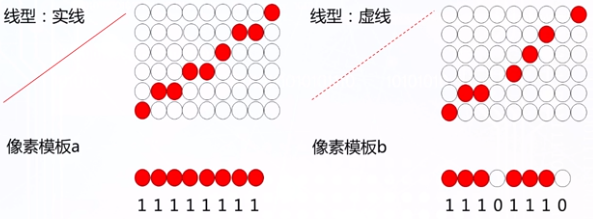

!>注意：由于像素模板应用在不同斜率的直线上会出现不同长度的空白段，所以对于不同斜率的直线需要及时调整像素模板

&emsp;&emsp;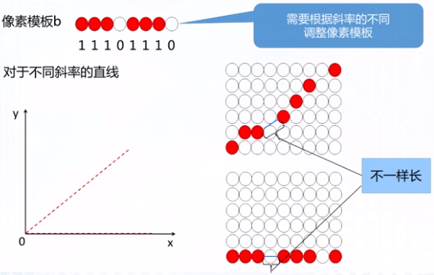

## 线宽的实现

将原有直线沿上下复制平移

存在的问题：

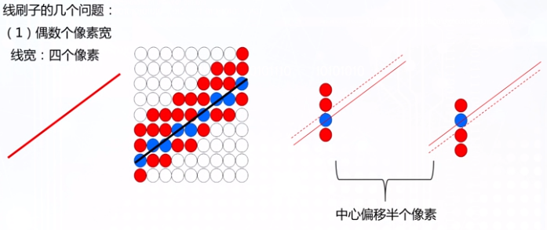

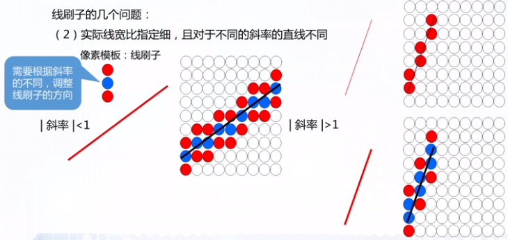

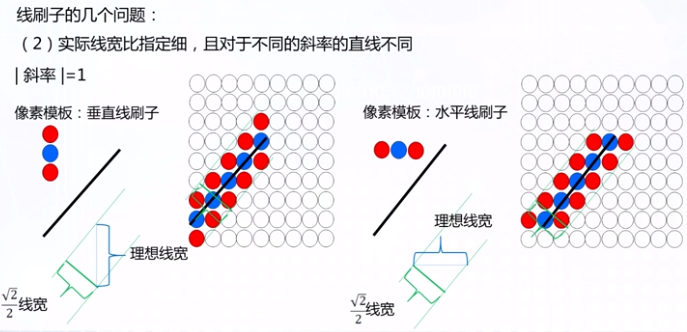

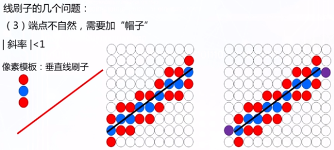

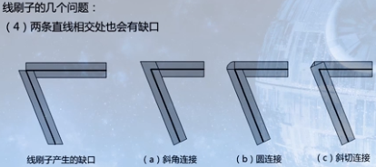

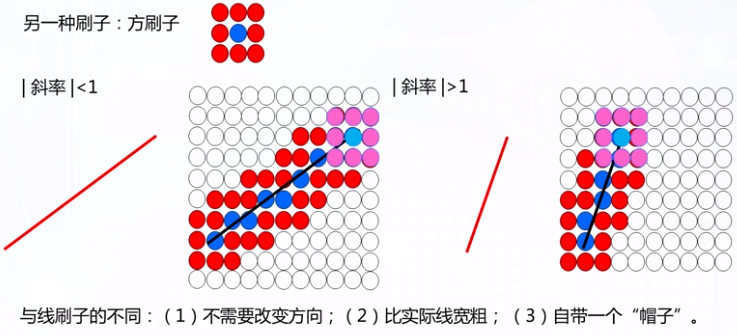

## 区域填充图案的实现

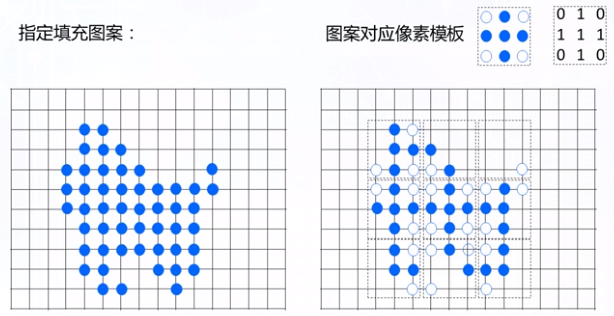

## 反走样

### 走样现象

走样的本质是用离散量表示连续量引起的失真

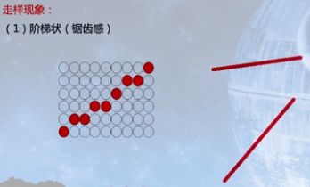

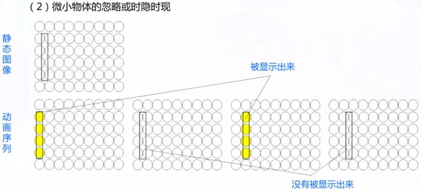

### 反走样

反走样的本质是用于减少或消除这种走样效果的技术

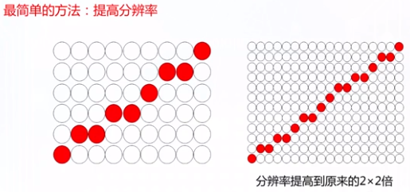

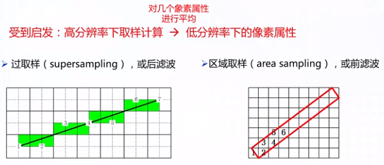

**(1) 过取样**

过取样法首先将显示分辨率提高一倍（X2），将直线离散化到细化的小网格上，然后对大网格着色时颜色取四个小网格颜色的平均值。

\*但这样容易产生颜色不均匀问题

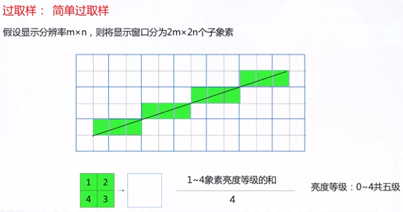

**(2) 重叠过取样**

解决过取样中容易产生颜色不均匀的问题

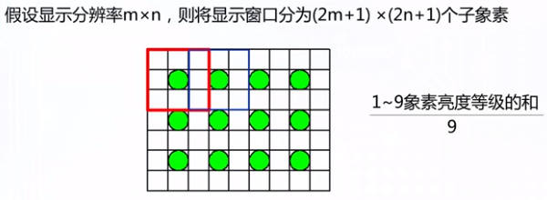

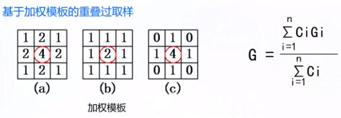

**(3) 区域取样**

直线为宽度至少为1的长方形

将像素点的亮度设置为与该长方形重叠部分面积成正比的值来绘制直线

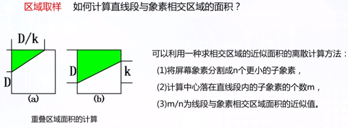

\*存在的问题：相同面积的重叠区域对像素的贡献相同，然而当直线段距离该像素中心点越近时，实际亮度应该更大

解决方法：

将立方体滤波改为高斯滤波或圆锥滤波

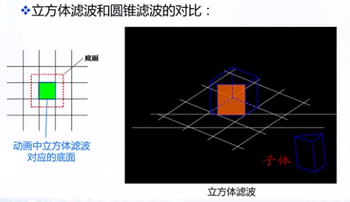

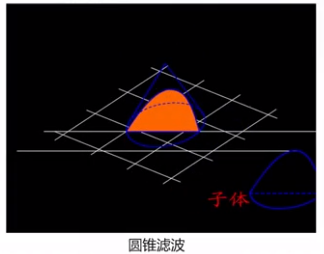

贡献度相当于高度为1的立方体/圆锥体被相交区域为底面，垂直于相交直线的平面切割后得到的三维物体的体积

换用圆锥之后约接近像素中心，虽然底面积一样但被切割出的三维物体的体积就越大

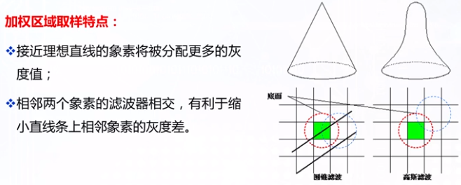

## 造型技术

### 基本图形元素

**顶点（Vertex）：**0维几何元素

**边（Edge）：**1维几何元素。对正则形体，边是两邻面的交集，对非正则形体，边有可能是多个邻面的交集。边的形状可以是直线也可以是曲线

**环（Loop）：**2维几何元素。有序、有向边组成的面的封闭边界。外环边通常按照逆时针方向排序，内环边通常按照顺时针方向排序。

**面（Face）：**2维几何元素。可以无内环，必须有且只有一个外环。有方向性，一般用其外法线方向作为该面的正向。形状可以是平面或曲面。

**体（Body）：**3维几何元素。由封闭表面围成的空间，其边界是有限面的并集。

### 几何造型

通过对点、线、面、体等几何元素经平移、放缩、旋转等几何变换和并、交、差等集合运算，产生实际的或想象的几何物体模型。

**物体表面的性质：**

1.  **连通性：**位于物体表面上的任意两个点都可用实体表面上的一条路径连接起来；
2.  **有界性：**物体表面可将空间分为互不连通的两部分，其中一部分是有界的；
3.  **非自相交性：**物体的表面不能自相交；
4.  **可定向性：**表面的两侧可明确定义出属于物体的内侧或外侧；
5.  **闭合性：**由表面上多边形网格各元素的拓扑关系决定的。

**实体的性质：**

1.  **刚性：**必须有一定的形状；
2.  **维数的一致性：**三维空间中，一个物体的各部分均应是三维的；
3.  **占据有限的空间：**体积有限；
4.  **边界的确定性：**根据物体的边界能区别处物体的内部及外部；
5.  **封闭性：**经过一系列刚体运动及任意序列的集合运算之后，仍然是有效的物体。

**实体的定义：**对于一个占据有限空间的正则形体，如果其表面时二维流形，则该正则形体为实体(正则形体+二维流形)

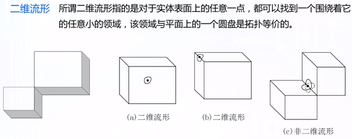

**欧拉公式对平面多面体的检查：**

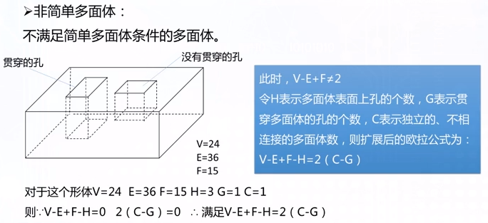

## 样条曲线

### 定义

样条是通过一组指定点集而生成平滑曲线的柔性带。

>   **样条曲线（spline curve）**指由多项式曲线段连接而成的曲线，在每段的边界处满足特定的连续性条件。

>   **样条曲面（spline surface）**指可使用两组样条曲线进行描述的曲面。

给定一组**控制点（control points）**的坐标点，可以得到一条样条曲线：

>   **插值（interpolate）**样条曲线：当选取的多项式使得曲线通过每个控制点，则所得曲线称为这组控制点的插值样条曲线；

>   **逼近（approximate）**样条曲线：当选取的多项式使部分或全部控制点都不在生成的曲线上。


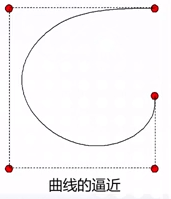

### 凸壳（convex hull）

>   **概念：**包含一组控制点的凸多边形边界

>   **作用：**样条以凸壳为界，保证了对象形态平滑地沿着控制点前进，而且给出了曲线或曲面的坐标范围，在裁剪和观察程序中十分有用

### 控制图（control graph）（控制多边形/特征多边形）

>   对于逼近样条，这一组连接控制点的线段通常称为曲线的控制图。

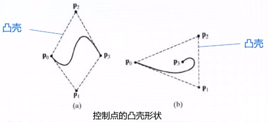

&emsp;&emsp;&emsp;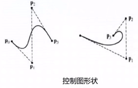

### 连续性条件（continuity conditions）

为保证分段参数曲线从一段到另一段平滑过渡，可以在连接点处要求各种连续性条件。

**参数连续性（parametric continuity）**

**零阶参数连续性（zero-order parametric
continuity）**记为**C0连续性**，可以简单地表示曲线相连。即第一条曲线段在u2处的x,y,z值与第二条曲线段在u1处的x,y,z值相等；

**一阶参数连续性（first-order parametric
continuity）**记为**C1连续性**，说明代表两条相邻曲线段的方程在相交点处有相同的一阶导数（切线）；

**二阶参数连续性（second-order parametric
continuity）**记为**C2连续性**，是指两条曲线段在交点处有相同的一阶和二阶导数；

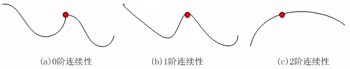

**几何连续性（geometric continuity）**

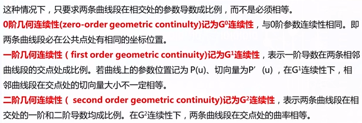

对于几何连续性，曲线将向具有较大切向量的部弯曲：

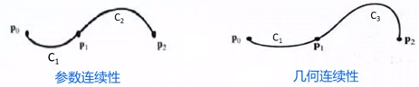

### 样条曲线的描述方法

**形式一：**

&emsp;&emsp;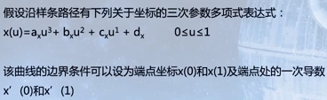

**形式二：**

&emsp;&emsp;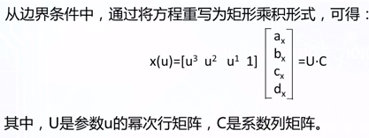

&emsp;&emsp;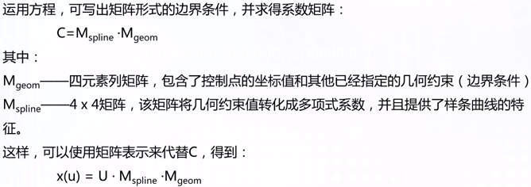

**形式三：**

&emsp;&emsp;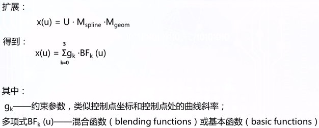

### 样条曲面的描述方法

&emsp;&emsp;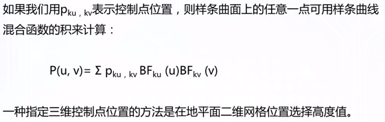

### Bezier曲线

**公式：**

&emsp;&emsp;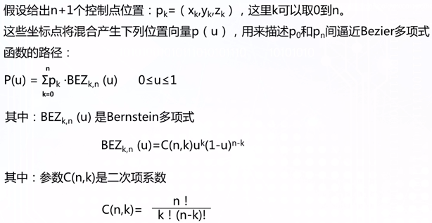

&emsp;&emsp;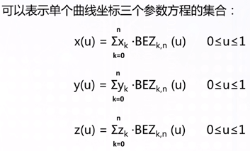

**特性：**

1.  曲线总是通过第一个和最后一个控制点；
2.  曲线始点处的切线落在头两个控制点的连线上，曲线终点处的切线落在后两个控制点的连线上；
3.  曲线落在控制点的凸壳内

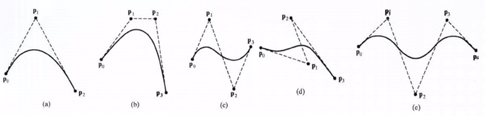

**设计技术：**

1.  封闭曲线，第一个和最后一个点重合；
2.  多个控制点位于同一个位置可以更多加权；
3.  两段曲线的拼接: 由两个Bezier曲线段形成的分段逼近曲线。让p0’=P2，使得p1,p2和p1’共线可以得到两条曲线段之间的零阶和一阶连续性

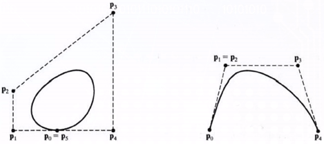

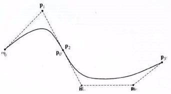

### Bezier曲面

&emsp;&emsp;**定义：**利用两组正交的Bezier曲线可以生成Bezier曲面，Bezier曲面的数学描述由Bezier基函数作笛卡尔积而得：

&emsp;&emsp;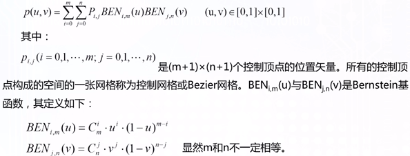

&emsp;&emsp;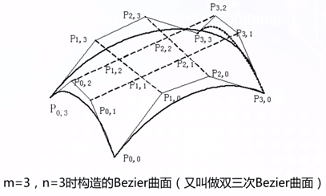

#### Bezier曲面的拼接

&emsp;&emsp;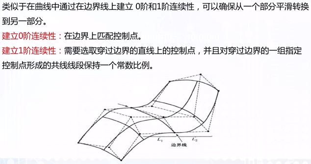

## 实体模型

### 三类表示形式

&emsp;&emsp;**边界表示（Boundary Representation,
&emsp;&emsp;B-reps），**即用一组曲面（含平面）来描述物体，这些曲面将物体分为内部和外部，边界表示又具体分为多边形表面模型（三角形、四边形）和扫描表示两种。

&emsp;&emsp;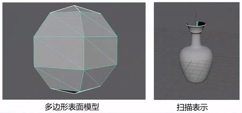

&emsp;&emsp;构造实体几何表示（Constructive Solid Geometry,
CSG），它将实体表示成立方体、长方体、圆柱体、圆锥体等基本体素的组合，可以采用并、交、差等运算构造新的形体。

&emsp;&emsp;

&emsp;&emsp;空间分割表示（Space-Partitioning），用来表述物体的内部性质，将包含一物体的空间区域划分为一组小的、非重叠的、连续实体（通常是立方体）。

&emsp;&emsp;

### CSG树

&emsp;&emsp;在构造实体几何表示法中，集合（Boolean、Transform、etc.）运算的实现过程可以用一颗二叉树（CSG树）来描述：

&emsp;&emsp;

&emsp;&emsp;**优点：**如果体素设置比较齐全，通过集合运算就可以构造出多种不同的符合需要的实体；

&emsp;&emsp;**缺点：**当用户输入体素时，主要是给定体素的有关参数，然后由系统给出该体素的表面方程，再由系统进行集合的求交运算，最后得到生成的实体。

!>问题：<br>1. 集合运算的中间结果难以用简单的代数方程表示，求交困难<br>2. 无法直接显示CSG树表示的形体

### 光线投射算法

&emsp;&emsp;

&emsp;&emsp;

&emsp;&emsp;

## 空间位置枚举表示

将包含实体的空间分割为大小相同、形状规则（正方形或立方体）的体素，然后，以体素的集合来表示图形对象

### 八叉树（octrees）

又称为分层树结构，它对空间进行自适应划分，采用具有层次结构的八叉树来表示实体


### 松散八叉树思想


**优点：**当有物体部分横跨两个区块时不必继续细分，树结构简单

**缺点：**会存在重复的空间，有额外的空间开销

### BSP树


#### 与八叉树比较：

>   **自适应分割：**BSP树可以减少场景树的深度，减少搜索时间；

>   **有向超平面：**有效地识别前向面和后向面。


**两个类型：（1）轴对齐；（2）多边形对齐（用多边形所在的平面划分场景）**


## 分形几何

**分形（Fractal）**，具有以非整数维形式充填空间的形态特征（非规则形体）

**特点：**

>   **不规则：**从整体上看，分形几何图形是处处不规则的

>   **自相似：**在不同尺度上，图形的规则性又是相同的


## 四元数

### 欧拉角和轴向角

**欧拉角**使用最简单的x,y,z值来分别表示在x，y，z轴上的旋转角度，其取值为0-360(或者0-2pi），一般使用roll，pitch，yaw来表示这些分量的旋转值。

需要注意的是，这里的旋转是针对世界坐标系说的，这意味着第一次的旋转不会影响第二、三次的转轴。

欧拉角容易出现的**问题**：

1.  不易在任意方向的旋转轴插值；

2.  万向节死锁；

3.  旋转的次序无法确定。

>   万向节死锁的数学证明：

我们从最简单的矩阵来理解。还是使用XYZ的旋转顺序。当Y轴的旋转角度为90°时，我们会得到下面的旋转矩阵：


我们对上述矩阵进行左乘可以得到下面的结果：


可以发现，此时当我们改变第一次和第三次的旋转角度时，是同样的效果，而不会改变第一行和第三列的任何数值，从而缺失了一个维度。

**轴向角**用一个以单位矢量定义的旋转角，再加上一个标量定义的旋转角来表示旋转。通常的表示[x,y,z,theta]，前面三个表示轴，最后一个表示角度。表示非常直观，也很紧凑。

轴向角最大的一个局限就是不能进行简单的插值，此外，轴角形式的旋转不能直接施于点或矢量，必转换为矩阵或者四元素。

### 四元数

**优点：**

>   四元旋转不存在万向节锁问题，存储空间小，计算效率高。

**缺点：**

>   **单个四元数不能表示在任何方向上超过180度的旋转，**数字表示不直观

### 矩阵旋转

**优点：**

>   与四元数一样，不存在万向节锁问题,
>   可以表示围绕任意轴的旋转，四元数的旋转轴均为通过物体中心点的轴，矩阵则不受限

**缺点：**

>   矩阵旋转使用4x4矩阵记录16个数值，而四元数只需要4个数值。计算复杂效率低

## 四元数补充

**(**<https://www.cnblogs.com/flyinggod/p/8144100.html>**)**

四元数也是使用一个3维向量(x,y,z)表示转轴和一个角度分量(w)表示绕此转轴的旋转角度，即(x,y,z,w)，一个四元数可以表示为q = w + xi + yj + zk，其中：


其中(ax,ay,az)表示轴的矢量，theta表示绕此轴的旋转角度。四元数中的每个数都是经过“处理”的轴和角，轴角描述的“四元组”并不是一个空间下的东西，首先（ax,ay,az）是一个3维坐标下的矢量，而theta则是级坐标下的角度，简单的将他们组合到一起并不能保证他们插值结果的稳定性，因为他们无法归一化，所以不能保证最终插值后得到的矢量长度（经过旋转变换后两点之间的距离）相等，而四元数是在一个统一的4维空间中，方便归一化来插值，又能方便的得到轴、角这样用于3D图像的信息数据，所以用四元数再合适不过了。相比于矩阵，四元素也只要存储4个浮点数，优势很明显。

**\*注意：**

1、用于旋转的四元数，每个分量的范围都在（-1，1）；

2、每一次旋转实际上需要两个四元数的参与，即q和q\*；

3、所有用于旋转的四元数都是单位四元数，即它们的模是1；

### 四元数运算法则

**乘法**

给定两个四元数p和q，分别代表旋转P和Q，则乘积pq表示两个旋转的合成（即旋转了Q之后再旋转P），并不是用加法。四元数的乘法定义如下，利用简单的分配律就是了：

q1 \* q2 =
(w1\*w2 - x1\*x2 - y1\*y2 - z1\*z2) + <br>
(w1\*x2 + x1\*w2 + y1\*z2 - z1\*y2) i + <br>
(w1\*y2 - x1\*z2 + y1\*w2 + z1\*x2) j + <br>
(w1\*z2 + x1\*y2 - y1\*x2 + z1\*w2) k

x = w \* q.x + x \* q.w + y \* q.z - z \* q.y; <br>
y = w \* q.y - x \* q.z + y \* q.w + z \* q.x; <br>
z = w \* q.z + x \* q.y - y \* q.x + z \* q.w; <br>
w = w \* q.w - x \* q.x - y \* q.y - z \* q.z; <br>

由于q = w + x i + y j + z k中可以分为纯量w与向量x i + y j + z
k，所以为了方便表示，将q表示为(S, V)，其中S表示纯量w，V表示向量x i + y j + z
k，所以四元数乘法又可以表示为：

q1 \* q2 = (S1 + V1)\*(S2 + V2) = S1\*S2 - V1.V2 + V1XV2 + S1\*V2 + S2\*V1

**求模**


**单位化**

Normalize( q ) = q/ \| q \|

**求共轭**

q\*=(-x, -y, -z, w)

**求逆**

对于向量逆的定义, q-1 =q\*/\|q\|2

对于单位四元素，分母为1，q-1 = q\* =(-x, -y, -z, w)

### 用四元数旋转矢量

给定一个矢量v，再给定一个旋转的单位四元素q，让v旋转q。

首先将v改写成四元素的形式v = (x, y ,z, 0),
 接下来要旋转v须用q前乘以矢量v，再后乘以q-1。

v’ = qvq-1

当然用后面乘以共轭的q也是一样的，因为都是单位四元素。

对于旋转多个四元数，比如 R=R1R2R3. 则


\*注意顺序

### 四元数的线性插值(lerp)和球面线性插值(Slerp)

四元素的可以方便地进行插值是四元素最大的优势。线性插值最为简单，效率也很高。给定两个旋转四元素qa和qb代表旋转A和旋转B，找到旋转A到旋转B之间的
t 的旋转：


注意这里的 t 实际上是是沿弦上走了t，而不是在球面上走t，这样就会导致当 t
以恒定速度改变时，角度的变化并非恒定


为了解决这个问题，就出现了球面线性插值。给定四元素q和q，


其中theta是两个四元素的夹角，


### 四元数与欧拉角转换

**四元数转欧拉角**


**欧拉角转四元数**


**四元数转旋转矩阵**

**\*四元数的共轭等于矩阵的转置**

Matrix4x4(1.0f - 2.0f\*y\*y - 2.0f\*z\*z, 2.0f\*x\*y - 2.0f\*z\*w, 2.0f\*x\*z +
2.0f\*y\*w, 0.0f,

2.0f\*x\*y + 2.0f\*z\*w, 1.0f - 2.0f\*x\*x - 2.0f\*z\*z, 2.0f\*y\*z -
2.0f\*x\*w, 0.0f,

2.0f\*x\*z - 2.0f\*y\*w, 2.0f\*y\*z + 2.0f\*x\*w, 1.0f - 2.0f\*x\*x -
2.0f\*y\*y, 0.0f,

0.0f, 0.0f, 0.0f, 1.0f)

**旋转矩阵转四元数**

（1）计算方式一（\*q0=w, q1=x, q2=y, q3=z）


!> 注意：上述的计算方式是存在不完整性的，因为四元数<strong>所有分量的计算都是通过开方所得，所有值都是非负数</strong>，这与实际是不相符的。没有准确的依据来确定是选择正根还是负根。

（2）计算方式二

计算相对于对角线堆成位置上的元素和与差：


我们可以发现，一旦对角线元素和/差的平方根解的了4个值中的一个，就能用以下方法计算其他的三个：


那么应该选以上四种的哪一种呢？

建议首先判断 w,x,y,z
中哪一个最大，就用对角线元素计算钙元素，然后再通过计算方式二中公式计算其他三个分量。


## 几何变换

### 二维几何变换

**· 二维平移**

平移（translation）:将位移量加到一个点的坐标上来生成一个新的坐标位置

上式中，将平移距离tx和ty加到原始坐标（x,y）上获得一个新的坐标位置（x’,y’），（tx,ty）称为**平移向量（translation
vector）**或**位移向量（shift vector）。**

矩阵形式：


**· 二维旋转**

旋转（rotation）：通过指定一个旋转轴（rotation axis）和一个旋转角度（rotation
angle），可以进行一次旋转变换


上式为点的旋转，r是点到原点的固定距离，角φ是电的原始角度位置与水平线的夹角，θ是旋转角

极坐标形式：


即点（x,y）旋转θ角的变换，还可以将它变换到绕任意位置（xr,yr）旋转的变换：


矩阵形式：


**· 二维缩放**

缩放（scaling）：通过将缩放系数（scaling factor）与对象坐标位置相乘改变一个对象的大小


矩阵形式：


可以选择一个在缩放变换后不改变位置的点，称为固定点（fixed point），如选择固定点为（xf, yf），则缩放后的坐标为：


**齐次坐标**

将二维坐标位置表示（x,y）扩充到三维表示（xh,yh,h），称为**齐次坐标**（homogeneous coordinate），这里的齐次参数h是一个非零值，通常我们取h=1

**· 二维平移矩阵**


**· 二维旋转矩阵**


**· 二维缩放矩阵**


### 逆变换

**· 逆平移变换**

对平移距离取负值得到逆矩阵（平移矩阵和其逆矩阵的乘积是一个单位矩阵）


**· 逆旋转矩阵**

旋转角度取负值得到逆矩阵，旋转矩阵的逆矩阵也等于其转置：


**· 逆缩放矩阵**

缩放系数取倒数得到逆矩阵（缩放矩阵和其逆矩阵的乘积是一个单位矩阵）


### 二维复合变换

利用矩阵表达式，可以通过计算单个变换的矩阵乘积，将任意的变换序列组成**复合变换矩阵**（composite
transformation
matrix），这一过程也称为矩阵的**合并**（concatenation）或**复合**（composition）

如果一个变换矩阵仅包含平移和旋转参数，则它是一个**刚体变换矩阵**（rigid-body
transform）

**· 通用二维基准点旋转**

通过平移-旋转-平移来实现绕任意选定的基准点(xr,yr)的旋转


**· 通用二维复合变换**

复合变换能够减少计算次数，所以变换操作的有效实现是先形成变换矩阵，合并所有变换序列，然后计算变换坐标。


### 其他二维变换

**· 反射（reflection）**

关于直线y=0（x轴）的反射变换矩阵：


关于对角线y=-x反射的变换矩阵：


这样的矩阵可以通过将一系列的旋转和坐标轴反射矩阵合并来推导得到，例如R’可以通过下列变换顺序合并矩阵得到：（1）顺时针旋转45’；（2）相对对于y轴反射；（3）逆时针旋转45’

> 反射矩阵的元素设为大于1的值时，镜像将远离反射轴

**· 错切（shear）**

错切是一种使形状对象发生变化的变换，经过错切的对象好像是由已经相互滑动的内部夹层组成

X方向错切矩阵：


该矩阵将形状对象的坐标转换成


### 三维几何变换

**· 三维平移**


**· 三维旋转**

绕Z轴旋转时：


替换坐标可以得到绕X轴与Y轴旋转的变换公式，绕X轴旋转：


绕Y轴旋转：


当θ取正值时，旋转是**逆时针**的，θ取负值可以得到逆矩阵，**或者也可以转置得到逆矩阵，即**

**欧拉角绕三个初始轴（X,Y,Z）的旋转矩阵**


### 一般三维旋转

**(tool:** <https://www.andre-gaschler.com/rotationconverter/>**)**

**(article:**<https://www.cnblogs.com/meteoric_cry/p/7987548.html>**)**

### 矩阵与坐标轴


